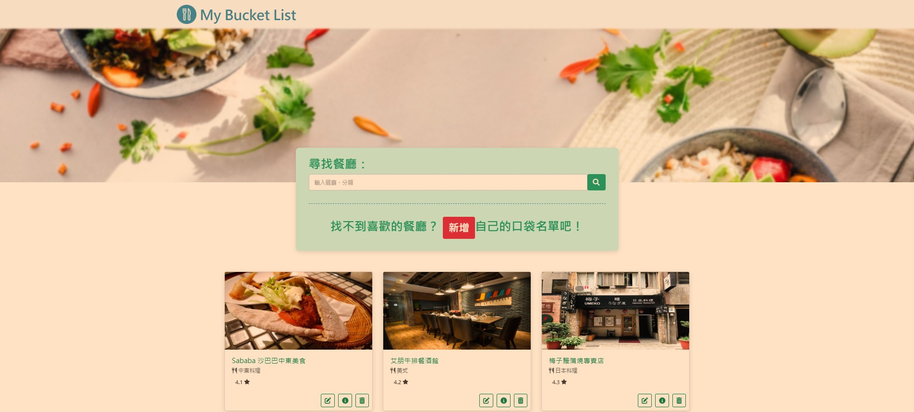
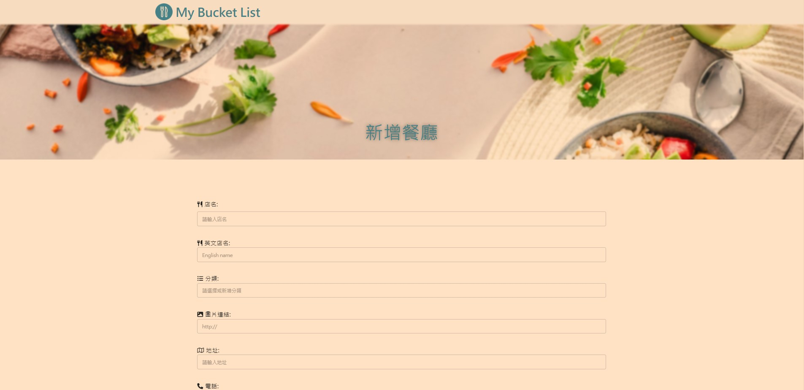

# Foodie's Diary
---
這是一個使用Node.js與Express所建立的餐廳資訊網站，使用者可以透過關鍵字搜尋餐廳，也可以新增、編輯自己喜愛的餐廳清單。
<p align="center">
  <h3>首頁</h3>
  
   <h3>新增餐廳頁面</h3>
  
   <h3>餐廳詳細資訊頁面</h3>
  
</p>

## 功能 Features
1. 使用者點擊餐廳，可以查看餐廳詳細資訊(包含店名、類型、地址、電話等)
2. 使用者可利用關鍵字搜尋功能進行搜尋
3. 使用者可以排序餐廳
3. 使用者可以新增一家餐廳
4. 使用者可以瀏覽一家餐廳的詳細資訊
5. 使用者可以瀏覽全部所有餐廳
6. 使用者可以修改一家餐廳的資訊
7. 使用者可以刪除一家餐廳
## 工具 Tools
1. [Node.js](https://nodejs.org/en/)(v14.16.0) - JavaScript執行環境
2. [Express](https://expressjs.com/)(v4.18.2) -網路框架(web framework)
3. [Express-handlebars](https://www.npmjs.com/package/express-handlebars)(v4.0.6) - 模板引擎
4. [Bootstrap](https://getbootstrap.com/)(v5.1.1) - 前端開發工具
5. [MongoDB](https://www.mongodb.com/) - 非關聯式資料庫（NoSQL）
6. [Mongoose](https://mongoosejs.com/)(v5.9.7) - MongoDB ODM
7. [Font Awesome](https://fontawesome.com/)(v6.2.1) - 圖形與字型設計套件
8. [Visual Studio Code](https://code.visualstudio.com/) - 程式碼編輯器
## 安裝指南 Installation Guide
1. 打開終端機，複製此專案至本機
```
git clone https://github.com/yy933/restaurant-list.git
```
2. 進入此專案資料夾
```
cd restaurant-list
```
3. 安裝npm套件 (Express、Handlebars、mongoose)

```
npm install
```
```
npm install express@4.18.2
```
```
npm install express-handlebars@6.0.6
```
```
npm install mongoose@5.9.7
```
4. 匯入種子資料
```
npm run seed
```
當終端機顯示 `mongodb connected!` 及 `restaurantSeeder done!`表示已成功匯入種子資料，按 ctrl + c 結束執行

5. 啟動伺服器
```
npm run start
```

6. 當終端機顯示 `Express is running on http://localhost:3000` ，代表已成功啟動伺服器並執行app.js檔案，至瀏覽器輸入 http://localhost:3000 即可使用本網站
